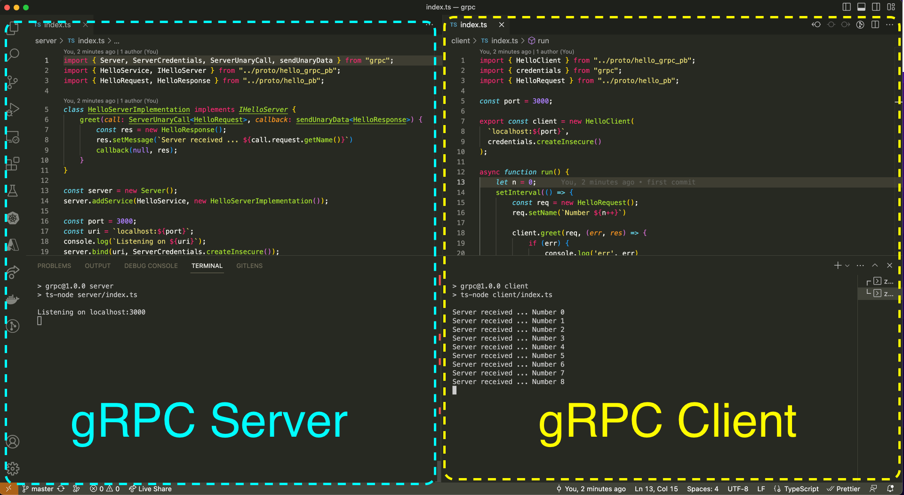

# gRPC Implementation
A simple starter to implement gRPC based services in NodeJS with Typescript



## Installation
```bash
# First terminal
git clone git@github.com:mrcyna/grpc-boilerplate.git
cd grpc-boilerplate
npm install
npm run server

# Second terminal
npm run client
```